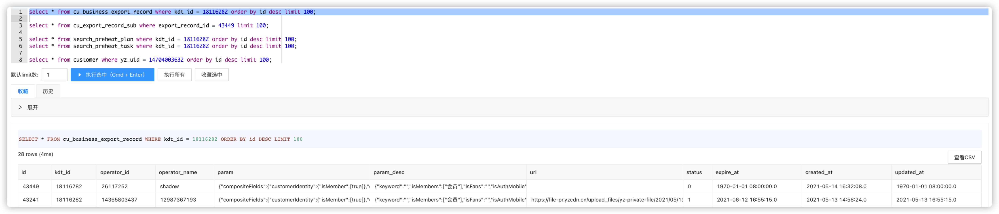
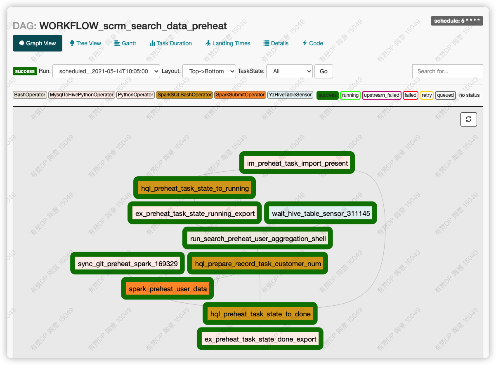
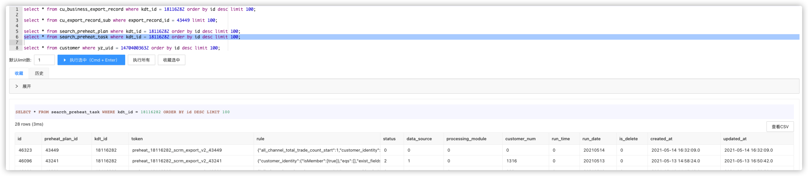
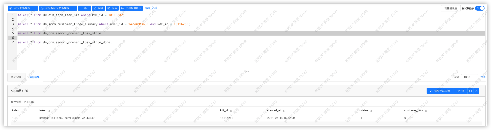
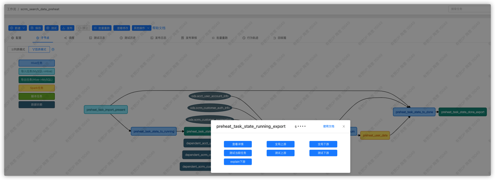

# 客户导出测试方法


客户导出时，根据选择导出的条目数，和在`scrm-search`应用的`Apollo`设置中的字段`preheat_last_customer_num`相比较，如果条目数大于设置的值，就会走离线任务，就需要去`Hive`里拉数据，如果条目数小于设置的值，就会走`ES`。

**情况一**：在测试环境，由于数仓里没有数据，所以只能测试条目数小于设置值的情况；&#x20;

**情况二**：在预发环境，还有另一个测一半的方法，在条目数小于设置值走`ES`的时候，只能验证导出条目数是否正确，无法验证导出的条目内的数据值是否正确；&#x20;

**情况三**：在预发环境，在走`ES`导出时，由于预发导出的`binlog`会走到线上，导致无法拉取到预发的数据，所以只能测试条目数大于设置值的情况；

### **情况一**测试方案：QA环境走ES导出条目数小于Apollo设置值的客户数「最简测试路径」

1. 筛选出条目数小于`Apollo`设置值的客户数，页面点击导出，触发导出任务；
2. 等导出完成后，在导出任务列表下载导出的文件，打开后和筛选列表做对比；

### **情况二**测试方案：预发客户导出测试「只测客户数量」

1. 筛选出条目数小于`Apollo`设置值的客户数，页面点击导出，触发导出任务；
2. 由于预发导出任务，最后生成文件是调用的线上的binLog，所以会造成生成的数据错误，所以需要手动调用预发的发消息接口给预发环境发消息，从而调用预发环境的代码去生成文件；&#x20;
   1.  确定消息体结构：

       ```javascript
            {
                "beginPage":1,
                "bizType":"scrm_export_v2",
                "endPage":2,
                "kdtId":94031156,
                "uniqueId":"43057"
            }
       ```

       `uniqueId`为导出任务在`crm.cu_business_export_record`表中的主键。在`B`端触发导出任务后，在表里通过如下`SQL`获取

       ```sql
        select * from cu_business_export_record where kdt_id = 94031156 order by id desc limit 100;
       ```

       `beginPage`为想要获取数据的起始页数。 `endPage`为想要获取数据的最后页数，默认为50条每页。
3.  命令行进入发消息的预发环境应用，理论上只需要是`SCRM`的预发应用都可以，调用`curl`命令发送消息：

    ```
         curl -d '{
             "configName": "CUSTOMER_DATA_EXPORT",
             "content": "{\"beginPage\":1,\"bizType\":\"scrm_export_v2\",\"endPage\":2,\"kdtId\":94031156,\"uniqueId\":\"43057\"}",
             "subTaskNo": "0002000037190523",
             "taskName": "scrm_export_v2_94031156_43057"
         }' "http://10.232.46.104:4151/pub?topic=customer_data_export_sub_task_process"
    ```
4.  获取最终文件下载地址 根据在`crm.cu_business_export_record`表中通过`kdtId`获取到的主键`uniqueId`，从`crm.cu_export_record_sub`表中获取到最终的文件地址，理论上来说，在未执行上一步的`curl`命令时，已经有生成了一个文件地址，在执行`curl`命令后，地址会变，生成最导出文件的地址。

    ```sql
     select * from cu_export_record_sub where export_record_id = 42966 limit 100;
    ```

### **情况三**测试方案：预发环境导出条目数大于Apollo设置值的客户数，走离线任务「最繁琐测试路径」

1. 筛选出条目数大于`Apollo`设置值的客户数，页面点击导出，触发导出任务；
2.  通过`情况二`的操作，拿到任务的`uniqueId`&#x20;

    &#x20;
3.  打开[客户导出离线任务的界面](http://data.qima-inc.com/dp/workflow/4515?tab=sub)，查看目前最新的调度是否完成（只有在当前调度完成，且下一个还没有开始前，我们才能开始运行测试）

    
4.  切换到`子节点`视图下的`图表模式`下，点击`preheat_task_state_to_running`任务，在弹窗中点击`查看详情`，脚本如下：

    ```sql
     drop table if exists dm_crm.search_preheat_task_state;
     create table if not exists dm_crm.search_preheat_task_state(
         `token` string comment '内部唯一标识',
         `kdt_id` bigint comment '店铺id',
         `created_at` string COMMENT '创建时间',
         `status` int COMMENT '状态0未执行1执行中2已完成',
         `customer_num` bigint COMMENT '匹配客户数'
     ) comment "此次执行离线任务状态回写"
     stored as orc;

     insert OVERWRITE table dm_crm.search_preheat_task_state 
     select 
     token,
     kdt_id,
     created_at,
     1,0 from 
     dm_crm.search_preheat_task
     -- where kdt_id in (94031156, 18116282);
    ```

    最后一行的`where kdt_id in (94031156, 18116282);`主要是在测试阶段，要确保影响范围，只跑对应店铺的数据，如果没有这一句，就会跑全量的数据，可以根据需要进行修改，修改完成后，点击`Explain`校验脚本，通过后点击`保存`；
5.  回到前面的弹窗，点击`测试上游`，从这里开始测试主要是为了确认，刚才自己触发的导出任务，是否进入了离线任务的调度中，确认方法如下，去对应的表里查对应任务的状态：

    RDS任务表状态：&#x20;

    &#x20;

    离线任务表状态：

    
6. 等待前面两个任务执行完成后，点击`preheat_task_state_running_export`任务，在弹窗中点击`测试下游`\
   ````

&#x20;直到后面的所有任务都跑完，在离线任务的表`dm_crm.search_preheat_task_state_done`会有一条数据，显示导出的客户数量，等任务执行结束后，在从页面下载导出文件，或者从库里展示的最终文件地址去下载导出表都可以。
